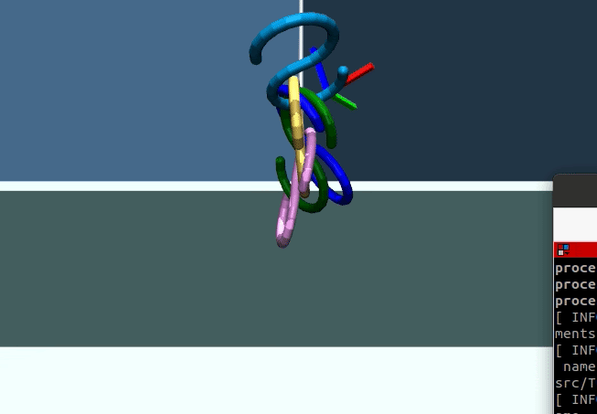
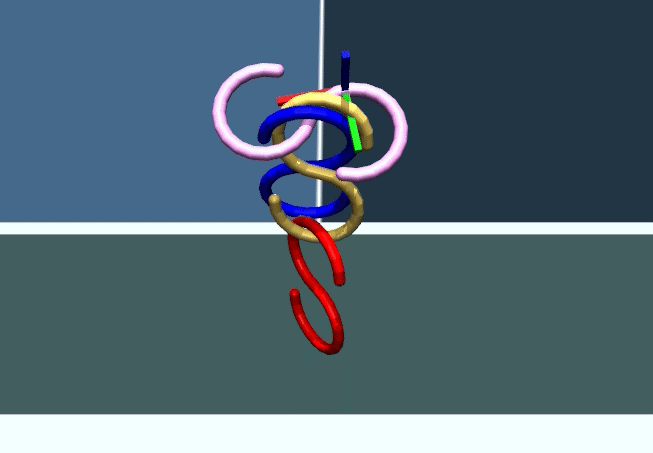
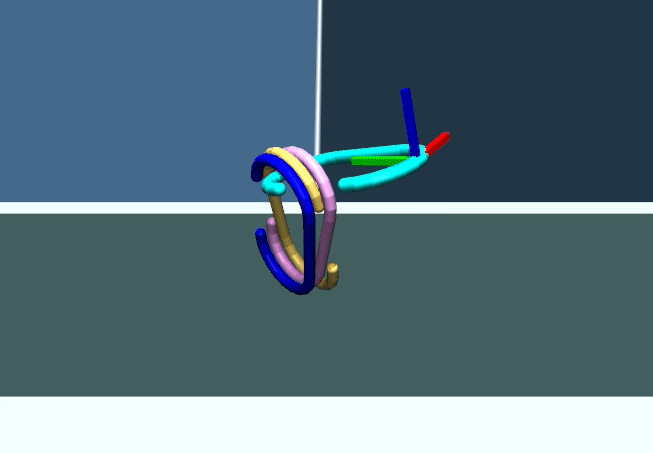
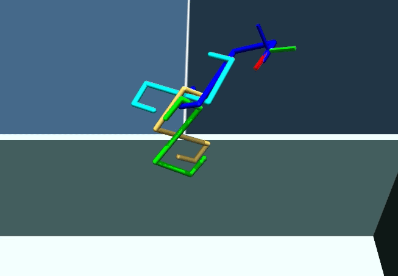
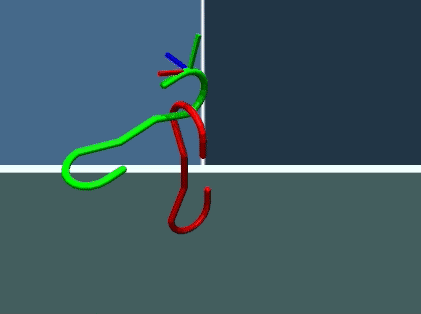
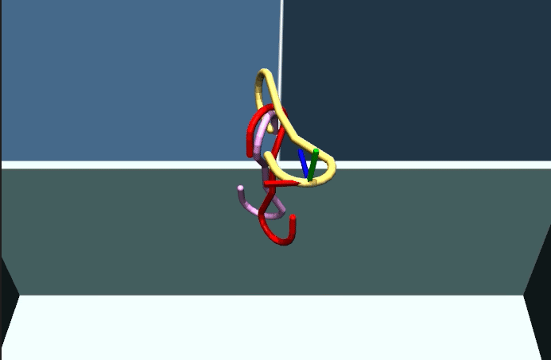
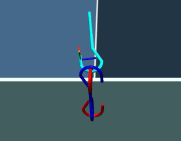
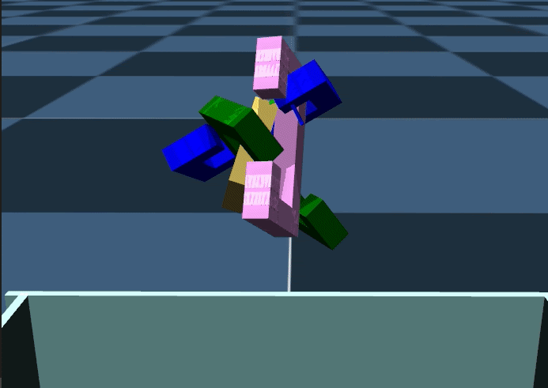
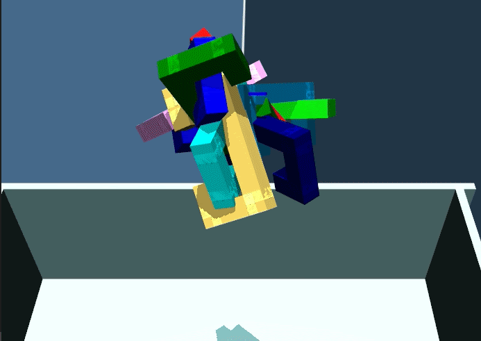
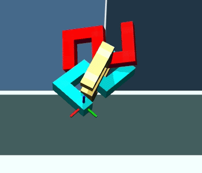

This repository contains some GIFs of the best trained model for each hook type.

For the S hook, Z-axis rotations are very useful for disentanglement:

Y rotation to orient the c-hook, followed by Z rotations to disentangle:

Example with the sharp S hook where the agent performed a Z+ rot and then a Z- rot to solve two different entanglement scenarios:

Solving entanglements with non-planar hooks:

Thicker hooks (based on related work) are challenging due to their increased thickness (the second case is a failure):

